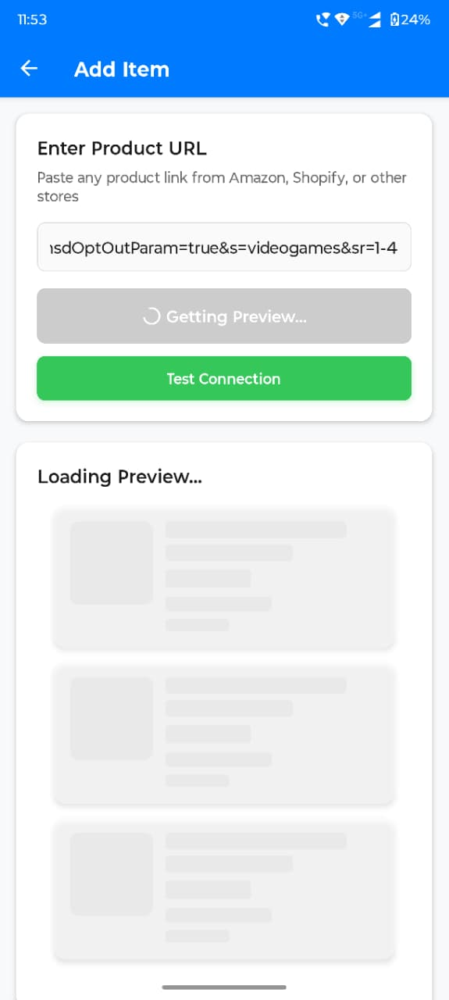

# Expo App — React Native Client

This project is the **mobile and web client** for our application, built with **React Native** using **Expo** and **Expo Router**. It’s designed to provide a smooth, cross-platform experience while connecting to a backend server for dynamic content, URL previews, quizzes, or AI-powered features.  

---

## 🌟 Features

- **Cross-platform support** — Works on **iOS, Android, and Web** with minimal changes.
- **File-based routing** — `expo-router` provides intuitive navigation similar to web apps.
- **Modern UI** — Integrates `expo-blur`, `expo-haptics`, and `react-native-reanimated` for smooth animations and gestures.
- **Offline support** — Local storage using `expo-sqlite` for caching or offline data.
- **Web content rendering** — `react-native-webview` enables viewing embedded web pages.
- **Vector icons** — Ready-to-use icons via `@expo/vector-icons`.

---

## 🛠 Setup Instructions

### 1. Install Dependencies
```bash
cd app
yarn install
2. Run the Project
bash
Copy code
# Start Expo dev server
yarn start

# Launch on Android
yarn android

# Launch on iOS
yarn ios


## Screenshots / Images





# Launch on Web
yarn web
3. Reset Project (Optional)
bash
Copy code
yarn reset-project
This clears caches and reinstalls dependencies for a clean slate if things break.

4. Environment Variables
Use .env or app.config.js for API endpoints and keys.

Ensure the backend server is running to fetch data for previews, quizzes, or AI services.

⚖ Tradeoffs & Decisions
Why Expo + React Native?

Quick cross-platform development.

Access to many Expo SDK features without touching native code.

Tradeoff: Slightly larger bundle size and limited low-level native customization unless ejecting.

Why expo-router?

File-based routing reduces boilerplate.

Makes navigation predictable and maintainable.

Tradeoff: Learning curve if coming from react-navigation only.

Why react-native-reanimated and expo-haptics?

Smooth, performant animations and tactile feedback enhance UX.

Tradeoff: Adds extra dependencies and initial setup complexity.

Bundle Size Consideration

Using multiple Expo libraries improves features but increases app size.

Optimizations may be needed for production builds (tree-shaking, lazy-loading).

🤖 AI & Automation Usage
This app is designed to work alongside a backend server that can integrate AI functionality:

URL Previews — Automatically fetch metadata and preview content using backend services.

Summarization & Recommendations — Backend can provide summarized content, quizzes, or suggested items based on AI.

Personalization — AI can adapt content dynamically based on user behavior.

Future AI Extensions:

Natural language search in-app.

Dynamic content ranking.

Intelligent notifications and suggestions.

The client is modular: you can add or replace AI-powered features without changing the core navigation.

✅ Notes & Best Practices
Ensure the backend server is reachable before using the app.

Keep dependencies updated but stable to avoid breaking changes.

For faster development, use yarn start with Expo DevTools.

All screens are modular — you can add, remove, or update pages without breaking navigation.

Made with ❤️ by Shrikant Jha